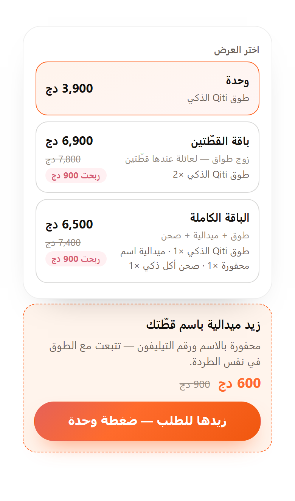

# Qiti

Page builder for cash-on-delivery stores. Renderer, API, admin, a Telegram bot I run the shop from, and a courier link that ships the order the moment I accept it.

Live: [qiti.vercel.app](https://qiti.vercel.app)

## What it is

Almost nobody here pays with a card, and nobody makes an account to buy one thing. Orders are cash to the delivery guy, so the whole flow is built around that: pick the product, type a name and a phone, choose a wilaya, done. Delivery price depends on the wilaya, and the 58 of them are in `lib/shipping-rates.mjs`.

There's no page file per product. A campaign points at a product, picks a theme and a list of sections, and takes a slug. The renderer builds the HTML when someone asks for it, so selling something else is a new row, not a new folder.

First thing I put on it is a GPS collar for cats. That's what the screenshots are.

 

## How a page gets made

```
GET /toji-outfit
      │
      ▼
  route table          slug → campaign id
      │
      ▼
  campaign ─────────► product      price, options, variants, stock
      │                  │
      ▼                  ▼
  theme (~15 tokens)   sections[]  ── section registry ──► HTML
      │
      ▼
  layout               head, SEO, footer
```

Everything falls through to `api/render` (rewrites are in `vercel.json`), so publishing doesn't need a deploy. Save in the admin, next request has it.

Sections: `hero`, `trust`, `features`, `how`, `lifestyle`, `gallery`, `reviews`, `faq`, `cta`, `order`. Only `order` touches money, and it takes the price and variants from the product, never from the campaign. A new campaign starts from a section order based on the product type (`pet`, `clothing`, `auto`, `tech`, `life`), then you drag them around.

Themes are about fifteen tokens: colors, radius, font. I let campaigns write their own CSS at first and after four of them it was four stylesheets nobody wanted to touch.

A campaign can also carry bundles and one upsell. A bundle is a few products with quantities and its own price, shown next to the single item so the customer picks one or the other. The upsell is offered after the order is placed: one tap adds it, no second form. Both are set up in the campaign editor, both deduct real stock per item when you accept the order, and a campaign that doesn't use them renders exactly as it did before.



## API

One file per route in `api/`, no router.

| Route | What it does |
|---|---|
| `api/render` | renders any public path, and answers `?communes=9` for the order form |
| `api/order` | takes an order, stores it, pings Telegram |
| `api/lead` | saves an abandoned form once the phone looks real |
| `api/telegram-webhook` | accept/decline taps and the bot commands |
| `api/admin-api` | one authenticated POST behind the dashboard |
| `api/admin-login` | password, then a code over Telegram |
| `api/media-upload`, `api/media-serve` | image upload and delivery |
| `api/track` | visit counters |
| `api/daily-report`, `api/weekly-report` | cron reports, midnight and Mondays. The daily one also pulls courier statuses |

Storage goes through `getStore()` in `lib/blobs.mjs`: Upstash Redis for data, Vercel Blob for images.

## Admin

`/admin`. Single page, hash routing, one `api()` call per action. Forms are generated from a field recipe instead of written out, and `npm run verify` fails if a section has a field the recipe doesn't.

Login is a password plus a 6-digit code the bot sends. Signed cookie after that, 7 days.


The dashboard is one request, not six. Six round trips on a bad connection is two seconds of blank screen.

<table>
<tr>
<td></td>
<td></td>
</tr>
</table>

Campaign preview calls the same `renderSections`/`renderPage` the server does. A separate preview drifts, and then you ship a page you never actually saw.

### Product serials

Every product carries a small number — `#1`, `#2` — assigned once at creation and never reused. It shows next to the product in the admin and in `/stock`, and it's what `/restock 3 10` addresses. Products with variants get `3.1`, `3.2`.

The numbers used to come from the product's position in a name-sorted list, so adding a product or renaming one silently shifted them: the same command you typed yesterday restocked a different item today, with no error to notice.

### The collar's stock

`index.html` is the first landing page in this repo — older than the catalog. Orders from it carry no `productId`, so its stock lived in a single global counter instead of a product's stock row. You could `/restock 20`, watch the number go up, open the admin, and find neither the product nor the quantity. Nothing was broken; the quantity was real but had nothing to hang on, and the admin lists products.

A one-time migration creates a real `Qiti Collar` product, moves the counter's quantity and threshold into its stock row, and zeroes the counter. `api/order.mjs` attaches that product to orders from the static page, so accepting an order decrements the same number the admin shows. Pricing stays on the old path on purpose: the price is baked into the static HTML, and computing from the catalog would let the page show one number while the courier collects another.

The product is created as a draft — the static page is still what customers buy from, and an active product would put a second page selling the same collar at `/p/qiti-collar`. Publish it when you retire the static page.

### Call queue

Accept/decline in Telegram works at twenty orders a day. At two hundred the messages scroll away, and "no answer, third try" ends up living in someone's head instead of in the shop.

`/admin#/queue` is that state written down. Every pending order and every unfinished form sits in one list, oldest first, with what happened on each call: who rang, when, and how it went — no answer, busy, phone off, asked me to call back, answered, wrong number. Logging an outcome schedules the next try from the outcome itself: busy comes back in fifteen minutes, no-answer backs off 45 minutes, then longer each time, and a customer who names a time gets that time instead.

Rows sort by what deserves attention, not by when the order arrived: confirmed by phone first (one tap from money), then calls that are due, then orders that ran out of tries, then the ones with a future appointment. After `MAX_ATTEMPTS` an order stops coming back to the top and becomes a decision instead of another call — without that ceiling, the number nobody ever answers outlives every order that could have sold.

The queue accepts and denies too. That logic lives in `lib/decisions.mjs` and both surfaces call it, so the dashboard's accept runs the same stock check, writes the same cost snapshot, and repaints the same Telegram message a button tap would. Attempts show up in the order message as well, and Telegram keeps a one-tap "called, no answer" button for the outcome that happens most.

Numbers in those shots are fake, there's no live store in the environment I take screenshots in.

## Telegram

I don't sit in the admin all day. The bot is where the shop actually gets run from, and every order shows up like this:


Name, phone in international form so tapping it works, wilaya and commune, delivery method with its price, quantity, where the customer came from (`utm_*`, `fbclid`, `ttclid` picked up on the landing page), and the total. The WhatsApp button opens a chat with that number, no copy-paste.

The buttons move the order through its states, and the message repaints itself after each tap, so the last version in the chat is always the current one:

```
pending ──[✅ accept]──► accepted ──[📦 delivered]──► delivered
   │                        │
   │                        └──────[↩️ returned]───► returned ──[📥 got it back]──► stock returns
   └──[❌ decline]──► denied
```

Accepting cuts stock right away. If there isn't enough, the tap is refused and the order stays undecided instead of going through with stock it doesn't have. Declining leaves stock alone. A return records the loss immediately, because the money is gone the moment the courier turns around, but the stock only comes back when I tap that I physically got the item, which can be a week later.

Accepting also sends the parcel, if the courier is set up. Delivered and returned can arrive on their own from there, without anyone tapping anything.

Commands only answer in the chat set as `TELEGRAM_CHAT_ID`.

| Command | Does |
|---|---|
| `/state` | orders right now, instead of waiting for the midnight report |
| `/stock` | stock per product and variant |
| `/cost` | product cost, ad cost per order, return loss. No redeploy |
| `/leads` | people who started the form and left |
| `/ship` | hand one order to the courier myself, when the automatic send is off or failed |
| `/sync` | pull parcel statuses now instead of waiting for the cron |
| `/block`, `/unblock`, `/blocked` | phone blocklist |
| `/clear` | wipes every order, asks twice first |

`/help` has the rest.

Reports come in on their own: one at midnight with the day, one on Monday with the week. The parcel events land in the same chat as they happen: gone out, moved, delivered with the profit on it, returned with the loss broken down line by line, or refused by the courier with the reason and the command to try again. Each of those can be switched off on its own, since a notification for every movement is a notification nobody reads.

If the bot goes quiet, check the webhook before reading any code. `GET /api/telegram-webhook?setup&key=<TELEGRAM_WEBHOOK_SECRET>` re-registers it and tells you what it set. That's been the problem nearly every time.

The key isn't ceremony. Re-registering passes `drop_pending_updates`, so an open endpoint let anyone throw away button taps that were queued while a function was cold — accepts and delivery outcomes included.

## The courier

Accepting an order used to stop at cutting stock. Now it also hands the parcel over. Qiti talks to Ecotrack, which isn't a courier but the platform most Algerian couriers run on (DHD, Conexlog, MSM Go, Rex). Each one gets its own host and its own token, so changing courier is two environment variables, not a rewrite:

```
ECOTRACK_URL=https://dhd.ecotrack.dz
ECOTRACK_TOKEN=…            server only, never sent to the browser
```

Leave them out and nothing changes: every call returns `{ skipped }`, accepting an order cuts stock and messages Telegram the way it always did.

`lib/ecotrack/` is the whole link.

| File | What it does |
|---|---|
| `client.mjs` | the HTTP, in one place: timeouts, 429 with their `Retry-After`, and their French validation errors folded into one readable line |
| `geo.mjs` | wilayas and communes, cached a day |
| `status.mjs` | their eleven activity names mapped onto the stages the shop uses, raw value kept alongside |
| `shipments.mjs` | create, cancel, retry, and the batched status pull |
| `sync.mjs` | what the cron runs |

Accept in Telegram and the order ships. `lib/decisions.mjs` calls `sendShipment`, the tracking number goes onto the order, and a message lands in the group with the tracking, the destination, and what the courier is collecting. Sending is idempotent: an attempt that created the parcel and then died on the second call keeps its tracking number, so a retry validates the parcel it already has instead of creating a twin. Failures back off 5, 20, 60 and 240 minutes and then stop asking, because a parcel the courier refuses four times is refused for a reason you have to go read.

There is no webhook. The documentation doesn't offer one and the live API doesn't have one, so status is pulled: `get/orders/status` takes 100 tracking numbers per call, and the daily cron walks every open parcel. `/sync` does it now instead of at 23:00.

A pulled status never writes the order directly. Delivered and returned go through `setDeliveryOutcome`, the same function the Telegram buttons call, so a parcel marked delivered by the courier snapshots costs and fires the same events as one I marked delivered by hand. Two paths to the same state is how you end up with an order that's delivered but never counted.

Four places where the live API and the documentation disagreed, all found by calling it:

- the token check is documented as POST; DHD's host answers GET and rejects POST
- `get/desks` returns 404; the desk list is a flag on each commune instead
- sending `stock` or `quantite` fails with `Module de stockage désactivé`, so neither is sent
- a status carries `date` and `time` as separate fields, not one timestamp

### The commune

The courier rejects a parcel whose commune it doesn't recognise, and by then the order is accepted and the customer has been told it's coming. Typed communes can't survive that: Boufarik gets written four ways and one of them is wrong.

So the form doesn't take a typed commune any more. Pick the wilaya, and the list is the courier's own communes, offices marked so a desk delivery only offers communes that have one.

The list rides on `api/render?communes=9` rather than its own function, since the Hobby plan counts functions and this answer is small and never changes. It's cached a day at the edge, and an empty answer is never cached: the first request went out before the courier's env vars existed, the CDN kept that emptiness for a day, and the field looked broken long after the setting was fixed.

### Not there yet

The admin doesn't show any of this. Tracking, parcel state and the buttons for send, retry and cancel exist in `lib/` and in Telegram, not on the order page, and there's no screen for the shipping settings or a shipping dashboard. That's the next piece of work, and until it lands the courier is run from the bot.

## Site, bot and admin on the same data

There's one store behind all three. `api/order` writes the order to Redis and then messages Telegram. A button tap goes to `api/telegram-webhook`, which updates that same record and repaints the message. The admin reads the same keys through `api/admin-api`. Nothing has its own copy, so nothing can disagree.

Decisions are one implementation for the same reason. Accept, deny, delivery outcome and return receipt used to live inside the Telegram click handler; they now live in `lib/decisions.mjs`, and the webhook and the admin both call it. Each of those does four things — write the record, move stock, snapshot costs, fire the Meta event — and a second copy would have skipped one of them within a month.

Stock works the same way. It's one number per variant, and `/stock`, the low-stock card on the dashboard, the accept button's check, and `/restock` all read and write that one number. This wasn't true early on. There were two counters, an old global one and the per-variant one, and `/restock` was updating the wrong one while the dashboard read the other.

Order totals get frozen at write time. The order stores its own `shippingFee`, and the cost snapshot is stored when the delivery outcome is recorded. Change a price or a cost tomorrow and last month's numbers stay what they were.

## Why the page is light

Built output, gzipped:

| File | Raw | Gzipped |
|---|---|---|
| `index.html` | 17.7 KB | 4.8 KB |
| `styles.css` | 41.4 KB | 8.3 KB |
| `main.js` | 24.7 KB | 6.7 KB |

About 20 KB over the wire for the whole page. No framework, no web font (system font, since a font request is half a second of invisible text on a bad connection), no analytics script, no cookie banner, nothing loaded from a CDN. The build strips comments out of the CSS and HTML, and the browser JS has none left in it. Images are the only heavy part, and they're the product.

The shipping table is inlined into the static page at build time, so the page can price delivery without waiting for an API call.

## Money

Delivery prices are per wilaya in `lib/shipping-rates.mjs`, `{ home, desk }` keyed by the official wilaya number rather than the name, since the name gets typed three different ways and one wrong character silently falls back to the default rate. `desk: null` means that wilaya has no delivery office, and the form greys the option out. Both null means the courier doesn't go there at all, the wilaya is disabled in the form and the server rejects it. Anything missing from the table falls back to 600 home / 400 desk, on purpose: a missing rate should sell at the normal price, not break the order.

What the customer pays:

```
total = unit price × quantity + shipping fee(wilaya, home|desk)
```

The shipping fee is not revenue. It passes through to the courier, so every calculation uses `goodsTotal = total − shippingFee`. Counting it as revenue inflates the number, and counting it as profit inflates it twice.

Profit per order:

```
delivered:  goodsTotal − unitCost × qty − adsCost − courierCost
returned:   − return loss, the rule below
anything else (pending, denied, still out): 0
```

The three costs come from `/cost` in Telegram, so I can change them without a deploy. Defaults are 1,500 for the product, 300 in ads per order, and 700 for a return, which is now only the fallback for orders recorded before the return rule existed. `courierCost` defaults to 0 because on cash on delivery the customer pays the delivery, but it's there for when I eat that cost.

A return is the part that used to be one flat number, and one flat number is wrong in both directions: a return from Tamanrasset doesn't cost what a return from Blida costs. It's a rule now, in `lib/settings.mjs`:

```
return loss = shipping out (what the courier charged me)
            + shipping back (returnShipPercent of the delivery fee)
            + returnExtraCost
            + the product itself, only if returnIncludesProduct
```

Defaults: `returnShipPercent: 50`, because half the fee on the way back is what couriers here ask, and `returnIncludesProduct: false`, because the collar comes back and sells again. Both are settings, not constants, since every courier negotiates differently and I'm not redeploying to change a percentage. Nothing about Algerian shipping prices is written into the code: the fees are the wilaya table, the return share is a percentage of whatever fee that order actually carried.

The rule is read at the moment the outcome is recorded and stored on the order with the rest of the cost snapshot, so changing the percentage tomorrow doesn't rewrite last month.

There's no screen for these yet. They live in Redis with the defaults above and `saveSettings` is waiting for the form.

What the customer pays for delivery and what the courier charges me are two different numbers, and the order keeps both. The first is `shippingFee`, quoted from the wilaya table when the order is placed. The second arrives with the parcel and goes into the cost snapshot. They're usually equal on cash on delivery, and the month they aren't is the month you want to have kept them apart.

## Running it

```bash
npx vercel dev                          # pages + API + admin, like production
PORT=8888 node scripts/dev-server.mjs   # files only, fastest when I'm in the admin
npm run verify                          # 342 checks
npm run build                           # writes dist/
npx vercel --prod                       # deploy
```

Has to be Vercel, or anything that runs `api/`. GitHub Pages can't host it.

## Environment

`TELEGRAM_BOT_TOKEN`, `TELEGRAM_CHAT_ID`, `TELEGRAM_WEBHOOK_SECRET`, `ADMIN_PASSWORD_HASH`, `ADMIN_SESSION_SECRET`, `CRON_SECRET`. Upstash and Blob add theirs when you connect them.

Optional: `ECOTRACK_URL` and `ECOTRACK_TOKEN` (the courier), `SITE_URL`, Twilio (`TWILIO_*`), Meta CAPI (`META_*`), trust check (`TKAWEN_*`). Skip one and that part doesn't run: without the courier pair, accepting an order still cuts stock and the shop works the way it did before.

Without both `ADMIN_*` vars the admin locks everyone out, including you. Hash the password with:

```bash
node -e "console.log(require('node:crypto').createHash('sha256').update('yourpassword').digest('hex'))"
```

## Layout

```
index.html          static storefront for the first product
assets/             styles.css + main.js
admin/              dashboard
api/                one file per route
lib/                renderer, catalog, storage, telegram, analytics
  render/sections/  the ten section types
  ecotrack/         the courier: client, communes, statuses, shipments
scripts/            build, rate injection, verify suite
```

`npm run build` copies `index.html`, `assets/` and `admin/` into `dist/` and nothing else. The list in `scripts/build.mjs` is an allowlist, so a new public file has to be added there or it won't ship. It used to be a blocklist and `lib/auth.mjs` was readable from outside.

Most files in `api/` and `lib/` open with a comment about why they're built that way. The browser JS has none left, since every visitor downloads it.

The Darija manual was deleted from the tree but it's still in the history:

```bash
git show 4580c7c:README.ar.md > README.ar.md
```
