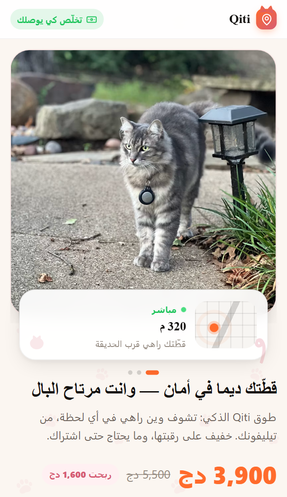
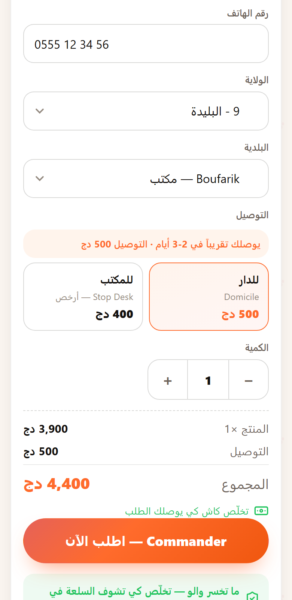
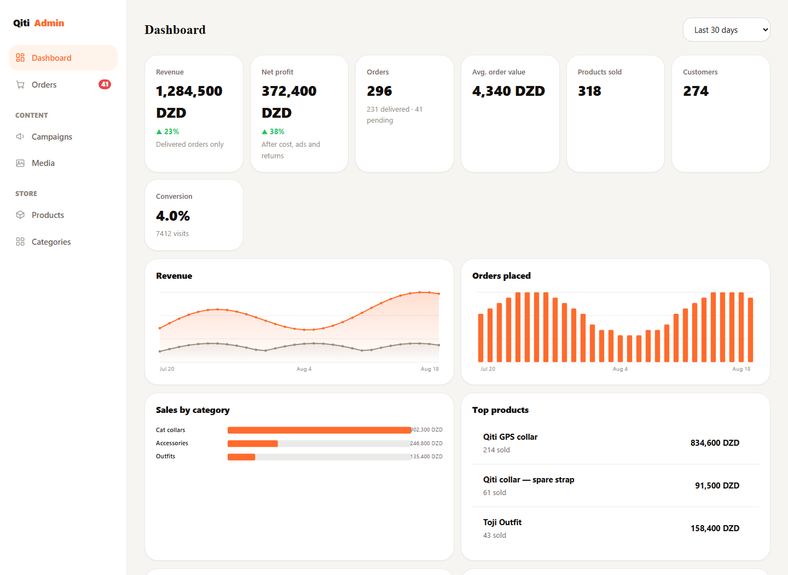
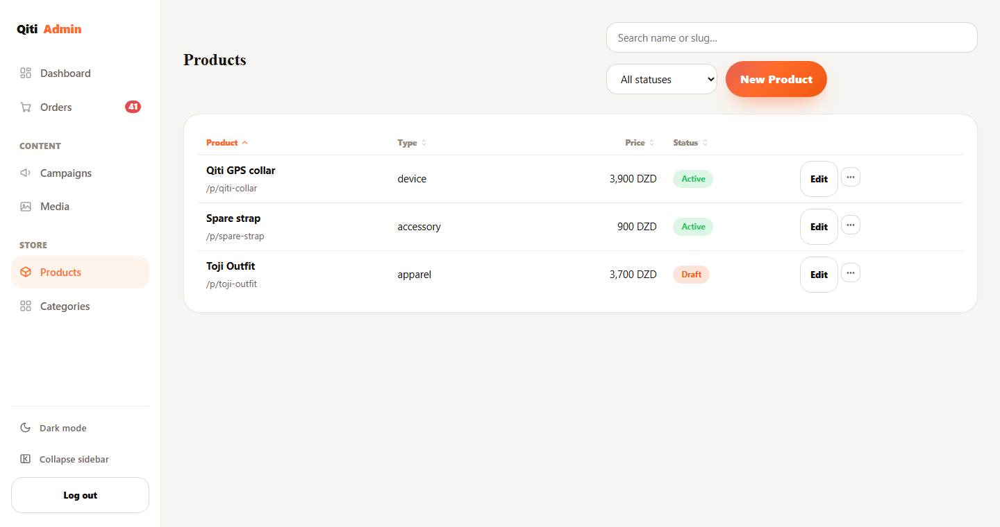
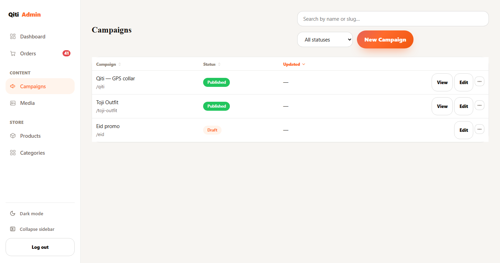
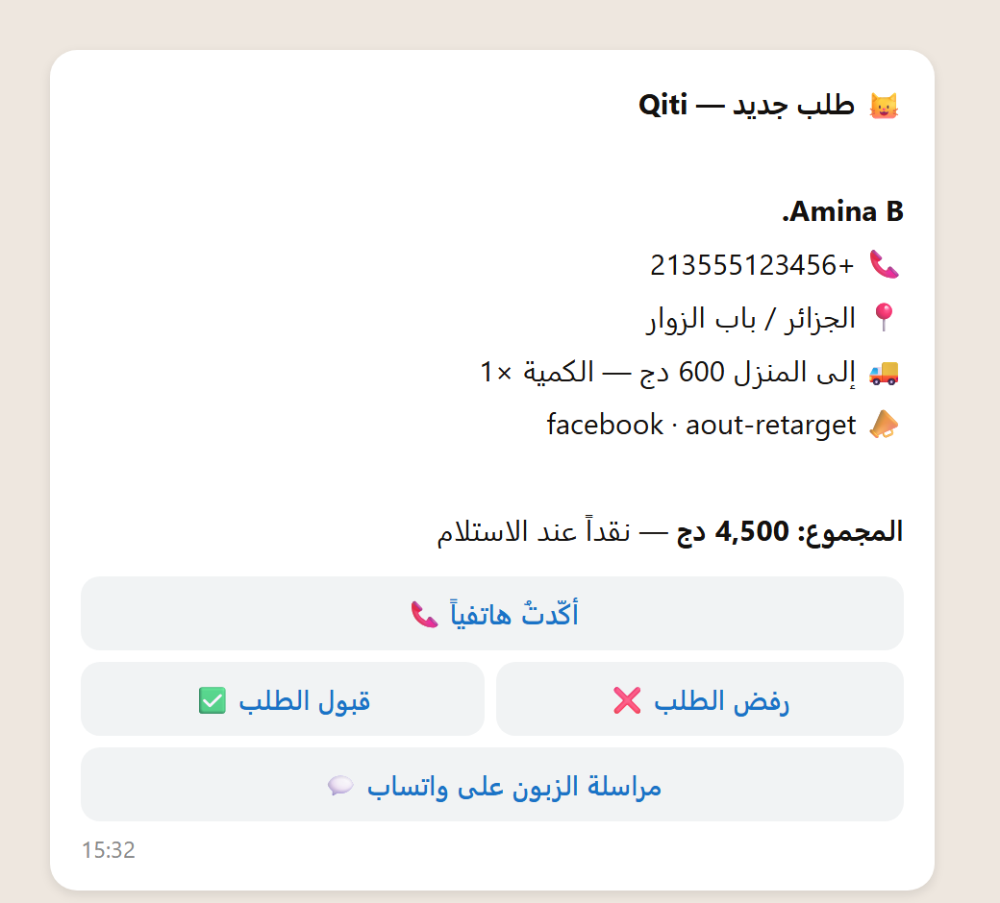

# Qiti

Page builder for cash-on-delivery stores. Renderer, API, admin, and a Telegram bot I run the shop from.

Live: [qiti.vercel.app](https://qiti.vercel.app)

## What it is

Almost nobody here pays with a card, and nobody makes an account to buy one thing. Orders are cash to the delivery guy, so the whole flow is built around that: pick the product, type a name and a phone, choose a wilaya, done. Delivery price depends on the wilaya, and the 58 of them are in `lib/shipping-rates.mjs`.

There's no page file per product. A campaign points at a product, picks a theme and a list of sections, and takes a slug. The renderer builds the HTML when someone asks for it, so selling something else is a new row, not a new folder.

First thing I put on it is a GPS collar for cats. That's what the screenshots are.

 

## How a page gets made

```
GET /toji-outfit
      │
      ▼
  route table          slug → campaign id
      │
      ▼
  campaign ─────────► product      price, options, variants, stock
      │                  │
      ▼                  ▼
  theme (~15 tokens)   sections[]  ── section registry ──► HTML
      │
      ▼
  layout               head, SEO, footer
```

Everything falls through to `api/render` (rewrites are in `vercel.json`), so publishing doesn't need a deploy. Save in the admin, next request has it.

Sections: `hero`, `trust`, `features`, `how`, `lifestyle`, `gallery`, `reviews`, `faq`, `cta`, `order`. Only `order` touches money, and it takes the price and variants from the product, never from the campaign. A new campaign starts from a section order based on the product type (`pet`, `clothing`, `auto`, `tech`, `life`), then you drag them around.

Themes are about fifteen tokens: colors, radius, font. I let campaigns write their own CSS at first and after four of them it was four stylesheets nobody wanted to touch.

A campaign can also carry bundles and one upsell. A bundle is a few products with quantities and its own price, shown next to the single item so the customer picks one or the other. The upsell is offered after the order is placed: one tap adds it, no second form. Both are set up in the campaign editor, both deduct real stock per item when you accept the order, and a campaign that doesn't use them renders exactly as it did before.

## API

One file per route in `api/`, no router.

| Route | What it does |
|---|---|
| `api/render` | renders any public path |
| `api/order` | takes an order, stores it, pings Telegram |
| `api/lead` | saves an abandoned form once the phone looks real |
| `api/telegram-webhook` | accept/decline taps and the bot commands |
| `api/admin-api` | one authenticated POST behind the dashboard |
| `api/admin-login` | password, then a code over Telegram |
| `api/media-upload`, `api/media-serve` | image upload and delivery |
| `api/track` | visit counters |
| `api/daily-report`, `api/weekly-report` | cron reports, midnight and Mondays |

Storage goes through `getStore()` in `lib/blobs.mjs`: Upstash Redis for data, Vercel Blob for images.

## Admin

`/admin`. Single page, hash routing, one `api()` call per action. Forms are generated from a field recipe instead of written out, and `npm run verify` fails if a section has a field the recipe doesn't.

Login is a password plus a 6-digit code the bot sends. Signed cookie after that, 7 days.



The dashboard is one request, not six. Six round trips on a bad connection is two seconds of blank screen.

<table>
<tr>
<td></td>
<td></td>
</tr>
</table>

Campaign preview calls the same `renderSections`/`renderPage` the server does. A separate preview drifts, and then you ship a page you never actually saw.

Numbers in those shots are fake, there's no live store in the environment I take screenshots in.

## Telegram

I don't sit in the admin all day. The bot is where the shop actually gets run from, and every order shows up like this:



(That's the output of `lib/message.mjs` for a made-up order, rendered locally. Not a screenshot of a real chat.)

Name, phone in international form so tapping it works, wilaya and commune, delivery method with its price, quantity, where the customer came from (`utm_*`, `fbclid`, `ttclid` picked up on the landing page), and the total. The WhatsApp button opens a chat with that number, no copy-paste.

The buttons move the order through its states, and the message repaints itself after each tap, so the last version in the chat is always the current one:

```
pending ──[✅ accept]──► accepted ──[📦 delivered]──► delivered
   │                        │
   │                        └──────[↩️ returned]───► returned ──[📥 got it back]──► stock returns
   └──[❌ decline]──► denied
```

Accepting cuts stock right away. If there isn't enough, the tap is refused and the order stays undecided instead of going through with stock it doesn't have. Declining leaves stock alone. A return records the loss immediately, because the money is gone the moment the courier turns around, but the stock only comes back when I tap that I physically got the item, which can be a week later.

Commands only answer in the chat set as `TELEGRAM_CHAT_ID`.

| Command | Does |
|---|---|
| `/state` | orders right now, instead of waiting for the midnight report |
| `/stock` | stock per product and variant |
| `/cost` | product cost, ad cost per order, return loss. No redeploy |
| `/leads` | people who started the form and left |
| `/block`, `/unblock`, `/blocked` | phone blocklist |
| `/clear` | wipes every order, asks twice first |

`/help` has the rest.

Reports come in on their own: one at midnight with the day, one on Monday with the week.

If the bot goes quiet, check the webhook before reading any code. `GET /api/telegram-webhook?setup` re-registers it and tells you what it set. That's been the problem nearly every time.

## Site, bot and admin on the same data

There's one store behind all three. `api/order` writes the order to Redis and then messages Telegram. A button tap goes to `api/telegram-webhook`, which updates that same record and repaints the message. The admin reads the same keys through `api/admin-api`. Nothing has its own copy, so nothing can disagree.

Stock works the same way. It's one number per variant, and `/stock`, the low-stock card on the dashboard, the accept button's check, and `/restock` all read and write that one number. This wasn't true early on. There were two counters, an old global one and the per-variant one, and `/restock` was updating the wrong one while the dashboard read the other.

Order totals get frozen at write time. The order stores its own `shippingFee`, and the cost snapshot is stored when the delivery outcome is recorded. Change a price or a cost tomorrow and last month's numbers stay what they were.

## Why the page is light

Built output, gzipped:

| File | Raw | Gzipped |
|---|---|---|
| `index.html` | 17.3 KB | 4.7 KB |
| `styles.css` | 41.3 KB | 8.2 KB |
| `main.js` | 22.4 KB | 6.2 KB |

About 19 KB over the wire for the whole page. No framework, no web font (system font, since a font request is half a second of invisible text on a bad connection), no analytics script, no cookie banner, nothing loaded from a CDN. The build strips comments out of the CSS and HTML, and the browser JS has none left in it. Images are the only heavy part, and they're the product.

The shipping table is inlined into the static page at build time, so the page can price delivery without waiting for an API call.

## Money

Delivery prices are per wilaya in `lib/shipping-rates.mjs`, `{ home, desk }` keyed by the official wilaya number rather than the name, since the name gets typed three different ways and one wrong character silently falls back to the default rate. `desk: null` means that wilaya has no delivery office, and the form greys the option out. Both null means the courier doesn't go there at all, the wilaya is disabled in the form and the server rejects it. Anything missing from the table falls back to 600 home / 400 desk, on purpose: a missing rate should sell at the normal price, not break the order.

What the customer pays:

```
total = unit price × quantity + shipping fee(wilaya, home|desk)
```

The shipping fee is not revenue. It passes through to the courier, so every calculation uses `goodsTotal = total − shippingFee`. Counting it as revenue inflates the number, and counting it as profit inflates it twice.

Profit per order:

```
delivered:  goodsTotal − unitCost × qty − adsCost − courierCost
returned:   − returnLoss
anything else (pending, denied, still out): 0
```

The three costs come from `/cost` in Telegram, so I can change them without a deploy. Defaults are 1,500 for the product, 300 in ads per order, 700 for a return. `courierCost` defaults to 0 because on cash on delivery the customer pays the delivery, but it's there for when I eat that cost.

## Running it

```bash
npx vercel dev                          # pages + API + admin, like production
PORT=8888 node scripts/dev-server.mjs   # files only, fastest when I'm in the admin
npm run verify                          # 253 checks
npm run build                           # writes dist/
npx vercel --prod                       # deploy
```

Has to be Vercel, or anything that runs `api/`. GitHub Pages can't host it.

## Environment

`TELEGRAM_BOT_TOKEN`, `TELEGRAM_CHAT_ID`, `TELEGRAM_WEBHOOK_SECRET`, `ADMIN_PASSWORD_HASH`, `ADMIN_SESSION_SECRET`, `CRON_SECRET`. Upstash and Blob add theirs when you connect them.

Optional: `SITE_URL`, Twilio (`TWILIO_*`), Meta CAPI (`META_*`), trust check (`TKAWEN_*`). Skip one and that part doesn't run.

Without both `ADMIN_*` vars the admin locks everyone out, including you. Hash the password with:

```bash
node -e "console.log(require('node:crypto').createHash('sha256').update('yourpassword').digest('hex'))"
```

## Layout

```
index.html          static storefront for the first product
assets/             styles.css + main.js
admin/              dashboard
api/                one file per route
lib/                renderer, catalog, storage, telegram, analytics
  render/sections/  the ten section types
scripts/            build, rate injection, verify suite
```

`npm run build` copies `index.html`, `assets/` and `admin/` into `dist/` and nothing else. The list in `scripts/build.mjs` is an allowlist, so a new public file has to be added there or it won't ship. It used to be a blocklist and `lib/auth.mjs` was readable from outside.

Most files in `api/` and `lib/` open with a comment about why they're built that way. The browser JS has none left, since every visitor downloads it.


```bash
git show 4580c7c:README.ar.md > README.ar.md
```
